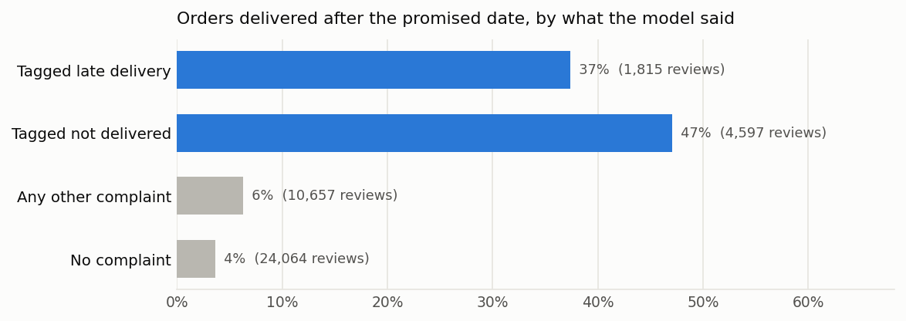
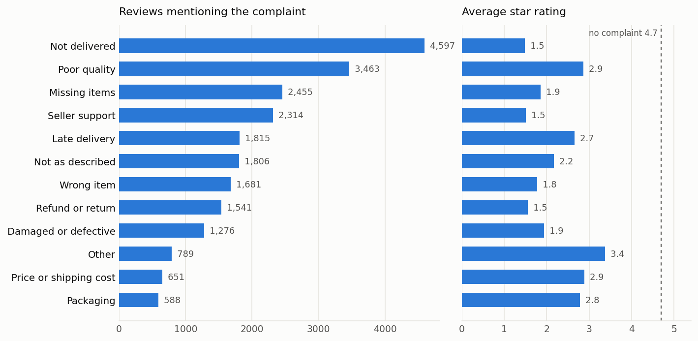
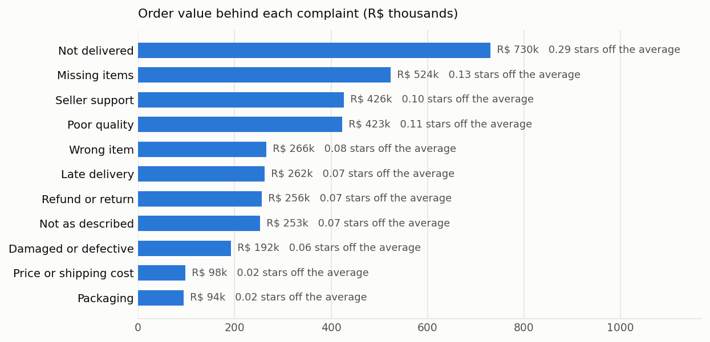

# Review Intelligence: full report

## 1. Data

Olist has 99,224 reviews, 40,950 of them with written text. Each written review was classified by qwen2.5:7b (prompt v2) running locally. Identical texts ("muito bom" appears thousands of times) are classified once.

## 2. How accurate is the model?

| Prompt | Exact match | Micro precision | Micro recall | Micro F1 | Macro F1 | Complaint detection |
|---|---|---|---|---|---|---|
| v1 | 77% | 0.73 | 0.83 | 0.78 | 0.74 | 98% |
| v2 | 81% | 0.76 | 0.88 | 0.81 | 0.81 | 99% |

Dev set: 150 reviews stratified by star rating, labelled against [docs/LABELLING_GUIDE.md](docs/LABELLING_GUIDE.md). v2 adds the guide's rules to the prompt. Weak spots that remain: the model tags refund_return when a customer only asks for a refund, rarely uses other_complaint, and is a little eager with poor_quality. The held-out test set has not been scored yet.

### An outside check: delivery records

The model never sees delivery dates, so comparing its delivery tags with the dates Olist recorded is a check that needs no labels.

| Reviews | Count | Delivered after the promised date | Never delivered | Median days late, when late |
|---|---|---|---|---|
| Tagged late delivery | 1,815 | 37% | 8% | 6 |
| Tagged not delivered | 4,597 | 47% | 23% | 9 |
| Any other complaint | 10,657 | 6% | 5% | 3 |
| No complaint | 24,064 | 4% | 1% | 2 |

## 3. What customers complain about

41% of written reviews contain at least one complaint. Reviews with no complaint average 4.70 stars.

| Theme | Reviews | Share of complaints | Avg stars | 1 star | Order value (R$) | Stars off the average |
|---|---|---|---|---|---|---|
| Not delivered | 4,597 | 27% | 1.49 | 76% | 730,095 | 0.287 |
| Poor quality | 3,463 | 21% | 2.86 | 30% | 422,851 | 0.115 |
| Missing items | 2,455 | 15% | 1.85 | 57% | 523,904 | 0.129 |
| Seller support | 2,314 | 14% | 1.51 | 75% | 426,037 | 0.103 |
| Late delivery | 1,815 | 11% | 2.66 | 34% | 262,076 | 0.073 |
| Not as described | 1,806 | 11% | 2.17 | 47% | 252,665 | 0.071 |
| Wrong item | 1,681 | 10% | 1.77 | 62% | 265,688 | 0.080 |
| Refund or return | 1,541 | 9% | 1.55 | 73% | 255,972 | 0.071 |
| Damaged or defective | 1,276 | 8% | 1.93 | 53% | 192,241 | 0.059 |
| Other | 789 | 5% | 3.38 | 15% | 126,531 | 0.019 |
| Price or shipping cost | 651 | 4% | 2.89 | 29% | 98,050 | 0.018 |
| Packaging | 588 | 3% | 2.78 | 24% | 93,869 | 0.017 |

Shares of complaints add up to more than 100% because a review can mention several problems. "Stars off the average" splits each review's shortfall equally between the themes it mentions.

## 4. Did complaints stop customers coming back?

Only orders placed at least 180 days before the data ends are counted, so every customer had time to return. Customers who left no complaint bought again 4% of the time (17,137 orders).

| Theme | Orders | Bought again | 95% interval |  |
|---|---|---|---|---|
| Not delivered | 3,764 | 3.8% | 3.2% | to 4.5% |
| Poor quality | 2,518 | 4.0% | 3.3% | to 4.8% |
| Seller support | 1,842 | 3.4% | 2.6% | to 4.3% |
| Missing items | 1,841 | 5.3% | 4.4% | to 6.4% |
| Late delivery | 1,536 | 2.5% | 1.8% | to 3.4% |
| Not as described | 1,268 | 3.9% | 3.0% | to 5.2% |
| Wrong item | 1,159 | 3.1% | 2.3% | to 4.3% |
| Refund or return | 1,139 | 4.7% | 3.6% | to 6.0% |
| Damaged or defective | 897 | 4.0% | 2.9% | to 5.5% |
| Other | 572 | 3.8% | 2.6% | to 5.8% |
| Price or shipping cost | 478 | 3.3% | 2.1% | to 5.4% |
| Packaging | 420 | 4.0% | 2.5% | to 6.4% |

The no complaint rate's 95% interval is 4.1% to 4.8%. Late delivery sits wholly below it (2.5%, 1.8% to 3.4%): about 30 fewer returning customers out of 1,536 than the no complaint rate would give. Every other theme overlaps the no complaint rate. Because repeat purchase is this rare, the money at stake through churn is small next to the order value each problem touches, so the fix list ranks by order value and rating.

## 5. Where the problems come from

Among 287 sellers with at least 30 written reviews, the worst 10% by complaint rate (29 sellers) draw a complaint on 67% of reviews against 39% for the rest, producing 12% of complaints from 8% of reviews. Ranking by rate rather than count keeps large sellers from being flagged just for their size.

**Not as described**, highest rate by category (at least 200 written reviews):

| Category | Reviews | Rate |
|---|---|---|
| home confort | 201 | 8.5% |
| home appliances | 348 | 6.3% |
| bed bath table | 4,259 | 6.2% |
| computers accessories | 2,719 | 6.1% |
| watches gifts | 2,483 | 5.8% |

**Poor quality**, highest rate by category (at least 200 written reviews):

| Category | Reviews | Rate |
|---|---|---|
| home confort | 201 | 16.4% |
| office furniture | 606 | 15.3% |
| bed bath table | 4,259 | 14.4% |
| luggage accessories | 415 | 11.8% |
| telephony | 1,837 | 10.9% |

**Damaged or defective**, highest rate by category (at least 200 written reviews):

| Category | Reviews | Rate |
|---|---|---|
| office furniture | 606 | 8.6% |
| telephony | 1,837 | 5.8% |
| electronics | 1,042 | 5.7% |
| computers accessories | 2,719 | 4.8% |
| cool stuff | 1,507 | 4.4% |

**Not delivered**, highest rate by category (at least 200 written reviews):

| Category | Reviews | Rate |
|---|---|---|
| baby | 1,046 | 14.0% |
| office furniture | 606 | 12.7% |
| home confort | 201 | 12.4% |
| sports leisure | 2,942 | 12.3% |
| health beauty | 3,344 | 11.8% |

## 6. Fix list

| Problem | Owner | Reviews | Order value (R$) | Stars off the average | First action |
|---|---|---|---|---|---|
| Not delivered | Logistics | 4,597 | 730,095 | 0.287 | Proactive alert and re-ship when a parcel stalls past the estimate; review carriers with the most stalled parcels |
| Missing items | Seller fulfilment | 2,455 | 523,904 | 0.129 | Pick and pack check for multi-unit orders; flag sellers who split shipments without telling the customer |
| Seller support | Seller operations | 2,314 | 426,037 | 0.103 | Response time target for sellers; tracking code sent automatically at dispatch |
| Poor quality | Catalogue | 3,463 | 422,851 | 0.115 | Review the lowest rated products in the worst categories with their sellers |
| Wrong item | Seller fulfilment | 1,681 | 265,688 | 0.080 | Variant (colour, size, voltage) check at packing for the sellers with the most wrong items |
| Late delivery | Logistics | 1,815 | 262,076 | 0.073 | Set delivery estimates from real carrier times per route instead of a fixed promise |
| Refund or return | Customer service | 1,541 | 255,972 | 0.071 | Clear return flow with a refund deadline |
| Not as described | Catalogue | 1,806 | 252,665 | 0.071 | Listing audit for the worst categories: photos, materials, 'original' claims |
| Damaged or defective | Seller and logistics | 1,276 | 192,241 | 0.059 | Packaging standard for fragile categories; quality check sellers with repeat defect complaints |
| Price or shipping cost | Pricing | 651 | 98,050 | 0.018 | Combine shipping for multi-item orders from one seller |
| Packaging | Seller fulfilment | 588 | 93,869 | 0.017 | Minimum packaging rules per category |

## 7. Limits

- Only written reviews are classified. 59% of reviews have no text, and the themes behind those are unknown.
- Order value is the value of orders that drew a complaint, not money lost. It sizes how much business each problem touches.
- The model's labels are not perfect (section 2). Theme counts carry that error, and rare themes carry the most.
- Olist data covers 2016 to 2018. The pattern of problems may have changed since.
